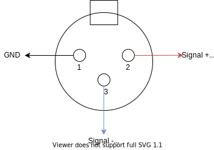

# Specifications

## Signals

Classic XLR input 3 position, differential signal + 48V phantom power
94 dB(A) SNR

Output using a mono jack 3.5mm
When no jack plugged => disable signal & phantom alimentation

Distortion with gain & tone, + master volume
Footswitch used to bypass all but the follower stages

One LED showing the bypass status

## Power

### Battery

One LiIon cell, charge when power is plugged in.
Use one led show the charging status (Charging, charged) and near discharged

At least 8 hours of autonomy when used

### Power cable

Using a power jack, input 9V DC